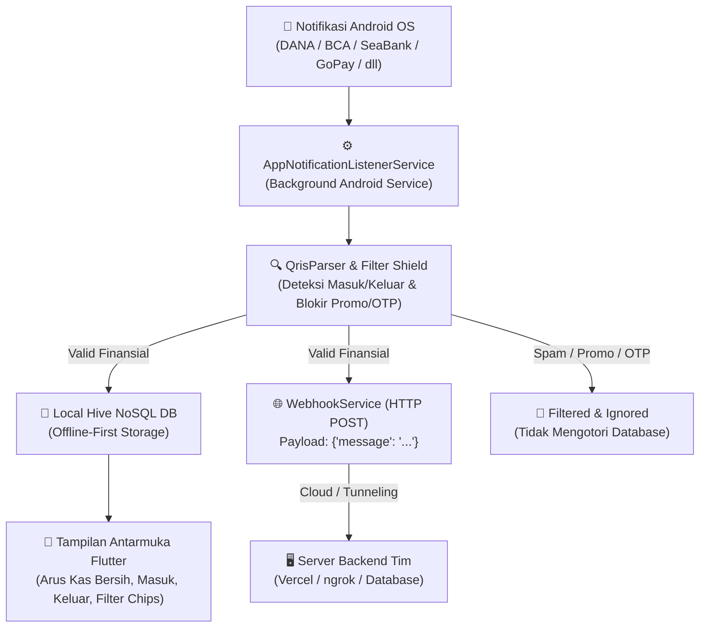

# 🏦 DompetKu: Android Financial Notification Listener & Webhook Bridge

**DompetKu** adalah aplikasi Flutter modern, ringan, dan aman yang dirancang untuk menangkap notifikasi transaksi perbankan & e-wallet pada smartphone Android secara realtime, menyimpannya di database lokal offline-first, serta meneruskannya ke server backend via **Webhook (HTTP POST)**.

Aplikasi ini mendukung pencatatan **Arus Kas Lengkap (Uang Masuk & Uang Keluar)**, dilengkapi **Filter Cerdas Anti-Promo & Anti-OTP**, serta **Pusat Edukasi & Simulator Interaktif** di dalam aplikasi.

---

## 🌟 Fitur Utama

1. **Pencatatan Arus Kas Lengkap (Masuk & Keluar)**:
   - **Uang Masuk**: QRIS, transfer bank masuk, top-up e-wallet (kode kanal: `dana_in`, `seabank_in`, `bca_in`, dll).
   - **Uang Keluar**: Tarik tunai di ATM/minimarket (Alfamart/Indomaret), transfer keluar, pembayaran tagihan & belanja (kode kanal: `dana_out`, `seabank_out`, `bca_out`, dll).
2. **Filter Cerdas Anti-Promo & Anti-OTP Shield**:
   - Menolak otomatis notifikasi sampah dan promosi (voucher belanja, cashback promo, koin, diskon flash sale, gratis ongkir).
   - Memblokir kode verifikasi/OTP, peringatan login, dan chat sosial (WhatsApp, Telegram, IG, dll) demi menjaga akurasi 100% data keuangan.
3. **Ekosistem Bank & E-Wallet Lengkap**:
   - Didukung dengan logo resmi: **DANA, SeaBank, ShopeePay, GoPay, OVO, Bank Jago, BCA Mobile, Livin by Mandiri, BRImo, wondr by BNI, Neobank, Jenius**.
4. **Penyimpanan Lokal Offline-First**:
   - Menggunakan database NoSQL **Hive** internal yang sangat cepat dan hemat baterai. Riwayat tetap aman tersimpan tanpa kuota internet.
5. **Integrasi Webhook Realtime**:
   - Mengirimkan HTTP POST otomatis berisi payload `{"message": "..."}` dengan header `Content-Type: application/json`.
   - Preset tim siap pakai (**Marsha Vercel Live 24/7**, **Willi ngrok**, **Fauzan ngrok**).
   - Fitur **Smart Paste Auto-Detect**: Cukup tempel URL raw dari chat, sistem otomatis mengonfigurasi endpoint tanpa perlu input manual yang rumit.
   - Deteksi otomatis respons server: `200 OK` maupun `201 Created` (standar cloud Vercel).
6. **Pusat Edukasi & Simulator Interaktif**:
   - **Alur Kerja 5-Langkah**: Visualisasi perjalanan data dari Android OS, Background Listener, Regex Parsing, Hive DB, hingga Webhook.
   - **Simulator Playground**: Pengujian instan template uang masuk, uang keluar, hingga uji penolakan notif promo tanpa perlu transaksi nyata.
   - **Kamus Konsep**: Penjelasan istilah teknologi digital lengkap untuk pemula dan pengembang.

---

## 🏗️ Arsitektur Alur Sistem



---

## 📁 Struktur Direktori Project

```text
dompetku/
├── android/                  # Konfigurasi native Android OS (Service & Permissions)
│   └── app/src/main/
│       └── AndroidManifest.xml  # Izin BIND_NOTIFICATION_LISTENER_SERVICE
├── lib/
│   ├── main.dart             # Entry point aplikasi, inisialisasi Hive & Listener
│   ├── models/
│   │   ├── transaction_model.dart     # Model transaksi, getter isIncoming/isOutgoing, type kanal
│   │   └── transaction_model.g.dart   # Hive TypeAdapter (auto-generated)
│   ├── services/
│   │   ├── notification_listener_service.dart # Background listener Android native
│   │   ├── qris_parser.dart          # Parser regex universal, detektor keluar, & filter promo
│   │   ├── database_service.dart     # Service Hive DB (Arus kas masuk/keluar & settings)
│   │   ├── webhook_service.dart      # HTTP POST sender, ping test, & error handler
│   │   └── csv_exporter.dart         # Export rekap transaksi ke CSV
│   ├── screens/
│   │   ├── home_screen.dart          # Beranda arus kas harian & filter riwayat
│   │   ├── detail_screen.dart        # Rincian transaksi & status webhook
│   │   ├── webhook_settings_screen.dart # Konfigurasi URL, Smart Paste, & Preset Tim
│   │   ├── education_guide_screen.dart  # Diagram alur, simulator live, & kamus
│   │   └── permission_screen.dart    # Panduan izin Notification Access Android
│   ├── widgets/
│   │   ├── summary_banner.dart       # Banner saldo bersih, total masuk vs keluar
│   │   ├── transaction_card.dart     # Kartu transaksi dinamis (+/- & logo bank)
│   │   └── empty_state.dart          # Tampilan responsif bebas overflow
│   └── utils/
│       ├── formatter.dart            # Formatter Rupiah & tanggal Indonesia
│       └── demo_data.dart            # Generator transaksi demo realistis
├── test/
│   ├── qris_parser_test.dart         # Unit test komprehensif (Masuk, Keluar, Promo, OTP)
│   ├── webhook_preset_test.dart      # Test parsing preset & smart paste
│   ├── webhook_service_test.dart     # Test HTTP POST & respons 200/201 Vercel
│   └── widget_test.dart              # Test integritas widget
├── PANDUAN_PRESENTASI.md             # Panduan lengkap demo 3 menit & FAQ penguji
└── pubspec.yaml                      # Dependensi Flutter & aset logo resmi
```

---

## 🚀 Panduan Menjalankan Aplikasi

### 1. Kebutuhan Sistem
- Flutter SDK (versi >= 3.2.0)
- Android SDK & Java 17
- Smartphone Android fisik atau Android Emulator

### 2. Langkah Menjalankan
```bash
# 1. Masuk ke direktori project
cd dompetku

# 2. Ambil seluruh dependency
flutter pub get

# 3. Jalankan unit test (70/70 skenario)
flutter test

# 4. Jalankan ke perangkat Android yang terhubung
flutter run
```

### 3. Mengaktifkan Izin Notifikasi di HP
1. Buka menu **Pengaturan** di HP Android.
2. Cari menu **Akses Notifikasi** (*Notification Access*).
3. Pilih **DompetKu** dan aktifkan izin.

---

## 🧪 Pengujian & Kualitas Kode

- **Flutter Analyze**: `0 issues found` (100% clean).
- **Unit Test Coverage**: `70 / 70 tests passed` (100% lulus).
- **Real Device Testing**: Teruji lancar pada perangkat fisik Xiaomi 14 (Android 16).

---

## 📄 Lisensi

Project ini dikembangkan untuk kebutuhan otomasi notifikasi kasir dan integrasi webhook backend.
